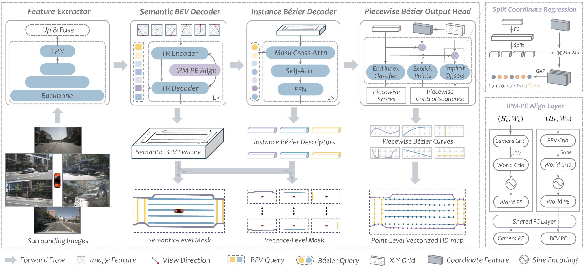

<div align="center"></div>
<div align="center"></div>
<div align="center"></div>

#
### NEWS !!!
* **`Aug. 23rd, 2023`:** :rocket: :rocket: :rocket: The official implementation of our BeMapNet is released now. Enjoy it!
* **`Jul. 14th, 2023`:** :clap: Our **PivotNet** is accepted by ICCV 2023 ! The preprint paper is in progress.
* **`Jun. 18th, 2023`:** :bulb: The **Innovation-Award** of the AD-Challenge goes to our MachMap Solution ! **[Tech-Report](https://arxiv.org/abs/2306.10301)**
* **`May. 26th, 2023`:** :trophy: Our team win the **Championship** of the CVPR23 *Online HD Map Construction Challenge* ! **[Leaderboard](https://opendrivelab.com/AD23Challenge.html#online_hd_map_construction)**
* **`May. 16th, 2023`:** :pushpin: We upload our long-version paper with detailed supplementary material on Arxiv. **[Paper](https://arxiv.org/pdf/2306.09700)**
* **`Feb. 28th, 2023`:** :clap: Our **BeMapNet** is accepted by CVPR 2023 ! Refer to the **[Paper](https://openaccess.thecvf.com/content/CVPR2023/html/Qiao_End-to-End_Vectorized_HD-Map_Construction_With_Piecewise_Bezier_Curve_CVPR_2023_paper.html)** for more details.

## <div align="center">Introduction</div>
**Vectorized high-definition map (HD-map) construction**, which focuses on the perception of centimeter-level environmental information, has attracted significant research interest in the autonomous driving community. In this paper, by delving into parameterization-based methods, we pioneer a concise and elegant scheme that adopts **UNIFIED** piecewise Bezier curve. In order to vectorize changeful map elements end-to-end, we elaborate a simple yet effective architecture, named **Piecewise Bezier HD-map Network (BeMapNet)**, which is formulated as a direct set prediction paradigm and postprocessing-free. The overall architecture contains four primary components for extracting progressively richer-infos: *image-level multi-scale features*, *semantic-level BEV feature*, *instance-level curve descriptors*, and *point-level Bezier control sequence*.
<div align="center"></div>

## <div align="center">Documentation</div>

<details open>
<summary><b>Step-by-step Installation</b></summary>
<\br><br>

- **a. Check Environment**
  ```shell
  Python >= 3.8
  CUDA 11.1
  # other versions of python/cuda have not been fully tested, but I think they should work as well.
  ```

- **b. Create a conda virtual environment and activate it. (Optional)**
  ```shell
  conda create -n bemapnet python=3.8 -y
  conda activate bemapnet
  ```

- **c. Install PyTorch and torchvision following the [official instructions](https://pytorch.org/get-started/previous-versions/).**
  ```shell
  pip3 install torch==1.10.1+cu111 torchvision==0.11.2+cu111 -f https://download.pytorch.org/whl/torch_stable.html
  ```

- **d. Install MMCV following the [official instructions](https://github.com/open-mmlab/mmcv). (need GPU)**
  ```shell
  pip3 install -U openmim
  mim install mmcv==1.7.1
  ```

- **e. Install Detectron2 following the [official instructions](https://detectron2.readthedocs.io/en/latest/tutorials/install.html).**
  ```shell
  python3 -m pip install detectron2 -f https://dl.fbaipublicfiles.com/detectron2/wheels/cu111/torch1.10/index.html
  ```

- **f. Install BeMapNet.**
  ```shell
  git clone git@git-core.megvii-inc.com:qiaolimeng/bemapnet.git -b bemapnet-release
  cd bemapnet
  pip3 install -r requirement.txt
  ```

</details>


<details>
<summary><b>Material Preparation</b></summary>
<\br><br>

- **a. Data: NuScenes**
  - Download&Unzip the [NuScenes](https://www.nuscenes.org/nuscenes#download) dataset into your server and link it to desirable path.
    ```shell
    cd /path/to/bemapnet
    mkdir data
    ln -s /any/path/to/your/nuscenes data/nuscenes
    ```
  - Generate Bezier-annotations from NuScenes's raw-annotations.
    ```shell
    cd /path/to/bemapnet
    python3 tools/bezier_converter/nuscenes/convert.py -d ./data -n bemapnet
    ```
  - **OR** download from [here](https://github.com/er-muyue/BeMapNet/releases/download/v1.0/bemapnet.zip) and put it into `/path/to/bemapnet/data/nuscenes`
    ```shell
    cd /path/to/bemapnet
    mkdir data/nuscenes/customer
    cd data/nuscenes/customer
    wget https://github.com/er-muyue/BeMapNet/releases/download/v1.0/bemapnet.zip .
    unzip bemapnet.zip bemapnet
    ```

- **b. Weights: Public-Pretrain-Models**
  - Download public pretrain-weights as backbone initialization.
    ```shell
    cd /path/to/bemapnet
    cd assets/weights
    wget https://github.com/er-muyue/BeMapNet/releases/download/v1.0/efficientnet-b0-355c32eb.pth .
    wget https://github.com/er-muyue/BeMapNet/releases/download/v1.0/resnet50-0676ba61.pth .
    wget https://github.com/er-muyue/BeMapNet/releases/download/v1.0/upernet_swin_tiny_patch4_window7_512x512.pth .
    ``` 
  
- **c. Check: Project-Structure**
  - Your project directory should be, 
    ```shell
      assets
        | -- weights (resnet, swin-t, efficient-b0, ...)
        | -- 
      bemapnet
      configs
      data
        | -- nuscenes
          | -- samples (CAM_FRONT, CAM_FRONT_LEFT, CAM_FRONT_RIGHT, ...)
          | -- annotations
          | -- v1.0-trainval
          | -- ...
          | -- customer
            | -- bemapnet
              | -- *.npz
      tools
    ```

</details>

<details>

<summary><b> Training and Evluation</b></summary>
<\br><br>

- **a. Model Training**
  ```shell
  bash run.sh train bemapnet_nuscenes_swint 30  # default: 8GPUs, bs=1, epochs=30
  ```

- **b. Model Evaluation**
  ```shell
  bash run.sh test bemapnet_nuscenes_swint ${checkpoint-path}
  ```

- **c. Reproduce with one command**
  ```shell
  bash run.sh reproduce bemapnet_nuscenes_swint
  ```
</details>

## <div align="center">Models & Results</div>

<details open>

<summary><b>Results on NuScenes Val Set</b></summary>
<\br><br>

- **a. Easy-Setting --> AP-threshold is `0.5m, 1.0m, 1.5m` (same as [VectorMapNet](https://arxiv.org/abs/2206.08920.pdf) / [MapTR](https://arxiv.org/abs/2208.14437.pdf))**

  | Model | Config | Schd | mAP<sup>divider</sup> | mAP<sup>pedcross</sup> |mAP<sup>boundary</sup> | mAP<sup>avg</sup> | Download |
  | :---: | :---: | :---: | :---: | :---:|:---:| :---: | :---: |
  |BeMapNet-Effb0| [config](configs/bemapnet_nuscenes_effb0.py) | 30ep | 62.2 | 56.0 | 59.0 | 59.1 |[model](https://github.com/er-muyue/BeMapNet/releases/download/v1.0/bemapnet_nuscenes_effb0_ep30_model.pth)/[train](https://github.com/er-muyue/BeMapNet/releases/download/v1.0/bemapnet_nuscenes_effb0_ep30_train.log)/[eval](https://github.com/er-muyue/BeMapNet/releases/download/v1.0/bemapnet_nuscenes_effb0_ep30_eval.log) |
  |BeMapNet-Res50| [config](configs/bemapnet_nuscenes_res50.py) | 30ep | 62.3 | 57.7 | 59.4 | 59.8 |[model](https://github.com/er-muyue/BeMapNet/releases/download/v1.0/bemapnet_nuscenes_res50_ep30_model.pth)/[train](https://github.com/er-muyue/BeMapNet/releases/download/v1.0/bemapnet_nuscenes_res50_ep30_train.log)/[eval](https://github.com/er-muyue/BeMapNet/releases/download/v1.0/bemapnet_nuscenes_res50_ep30_eval.log) |
  |BeMapNet-SwinT| [config](configs/bemapnet_nuscenes_swint.py) | 30ep | 64.4 | 61.2 | 61.7 | 62.4 |[model](https://github.com/er-muyue/BeMapNet/releases/download/v1.0/bemapnet_nuscenes_swint_ep30_model.pth)/[train](https://github.com/er-muyue/BeMapNet/releases/download/v1.0/bemapnet_nuscenes_swint_ep30_train.log)/[eval](https://github.com/er-muyue/BeMapNet/releases/download/v1.0/bemapnet_nuscenes_swint_ep30_eval.log) |
  |BeMapNet-Res50| [config](configs/bemapnet_nuscenes_res50.py) | 110ep | 66.7 | 62.6 | 65.1 | 64.8 |[model](https://github.com/er-muyue/BeMapNet/releases/download/v1.0/bemapnet_nuscenes_res50_ep110_model.pth)/[train](https://github.com/er-muyue/BeMapNet/releases/download/v1.0/bemapnet_nuscenes_res50_ep110_train.log)/[eval](https://github.com/er-muyue/BeMapNet/releases/download/v1.0/bemapnet_nuscenes_res50_ep110_eval.log) |
  |BeMapNet-SwinT| [config](configs/bemapnet_nuscenes_swint.py) | 110ep | 68.9 | 64.6 | 67.5 | 67.0 |[model](https://github.com/er-muyue/BeMapNet/releases/download/v1.0/bemapnet_nuscenes_swint_ep110_model.pth)/[train](https://github.com/er-muyue/BeMapNet/releases/download/v1.0/bemapnet_nuscenes_swint_ep110_train.log)/[eval](https://github.com/er-muyue/BeMapNet/releases/download/v1.0/bemapnet_nuscenes_swint_ep110_eval.log) |

- **b. Hard-Setting --> AP-threshold is `0.2m, 0.5m, 1.0m` (Recommended as a more practical HD map evaluation protocol)**

  | Model | Config | Schd | mAP<sup>divider</sup> | mAP<sup>pedcross</sup> |mAP<sup>boundary</sup> | mAP<sup>avg</sup> | Download |
  | :---: | :---: | :---: | :---: | :---:|:---:| :---: | :---: |
  |BeMapNet-Effb0| [config](configs/bemapnet_nuscenes_effb0.py) | 30ep | 46.7 | 37.4 | 38.0 | 40.7 |[model](https://github.com/er-muyue/BeMapNet/releases/download/v1.0/bemapnet_nuscenes_effb0_ep30_model.pth)/[train](https://github.com/er-muyue/BeMapNet/releases/download/v1.0/bemapnet_nuscenes_effb0_ep30_train.log)/[eval](https://github.com/er-muyue/BeMapNet/releases/download/v1.0/bemapnet_nuscenes_effb0_ep30_eval.log) |
  |BeMapNet-Res50| [config](configs/bemapnet_nuscenes_res50.py) | 30ep | 46.9 | 39.0 | 37.8 | 41.3 |[model](https://github.com/er-muyue/BeMapNet/releases/download/v1.0/bemapnet_nuscenes_res50_ep30_model.pth)/[train](https://github.com/er-muyue/BeMapNet/releases/download/v1.0/bemapnet_nuscenes_res50_ep30_train.log)/[eval](https://github.com/er-muyue/BeMapNet/releases/download/v1.0/bemapnet_nuscenes_res50_ep30_eval.log) |
  |BeMapNet-SwinT| [config](configs/bemapnet_nuscenes_swint.py) | 30ep | 49.1 | 42.2 | 39.9 | 43.7 |[model](https://github.com/er-muyue/BeMapNet/releases/download/v1.0/bemapnet_nuscenes_swint_ep30_model.pth)/[train](https://github.com/er-muyue/BeMapNet/releases/download/v1.0/bemapnet_nuscenes_swint_ep30_train.log)/[eval](https://github.com/er-muyue/BeMapNet/releases/download/v1.0/bemapnet_nuscenes_swint_ep30_eval.log) |
  |BeMapNet-Res50| [config](configs/bemapnet_nuscenes_res50.py) | 110ep | 52.7 | 44.5 | 44.2 | 47.1 |[model](https://github.com/er-muyue/BeMapNet/releases/download/v1.0/bemapnet_nuscenes_res50_ep110_model.pth)/[train](https://github.com/er-muyue/BeMapNet/releases/download/v1.0/bemapnet_nuscenes_res50_ep110_train.log)/[eval](https://github.com/er-muyue/BeMapNet/releases/download/v1.0/bemapnet_nuscenes_res50_ep110_eval.log) |
  |BeMapNet-SwinT| [config](configs/bemapnet_nuscenes_swint.py) | 110ep | 54.2 | 46.5 | 46.5 | 49.1 |[model](https://github.com/er-muyue/BeMapNet/releases/download/v1.0/bemapnet_nuscenes_swint_ep110_model.pth)/[train](https://github.com/er-muyue/BeMapNet/releases/download/v1.0/bemapnet_nuscenes_swint_ep110_train.log)/[eval](https://github.com/er-muyue/BeMapNet/releases/download/v1.0/bemapnet_nuscenes_swint_ep110_eval.log) |

</details>

#
## Citation
If you find BeMapNet/MachMap is useful in your research or applications, please consider giving us a star :star: and citing them by the following BibTeX entries:
```
@InProceedings{Qiao_2023_CVPR,
    author    = {Qiao, Limeng and Ding, Wenjie and Qiu, Xi and Zhang, Chi},
    title     = {End-to-End Vectorized HD-Map Construction With Piecewise Bezier Curve},
    booktitle = {Proceedings of the IEEE/CVF Conference on Computer Vision and Pattern Recognition (CVPR)},
    month     = {June},
    year      = {2023},
    pages     = {13218-13228}
}

@article{qiao2023machmap,
    author={Limeng Qiao and Yongchao Zheng and Peng Zhang and Wenjie Ding and Xi Qiu and Xing Wei and Chi Zhang},
    title={MachMap: End-to-End Vectorized Solution for Compact HD-Map Construction}, 
    journal={arXiv preprint arXiv:2306.10301},
    year={2023},
}
```


## Stars

[](https://starchart.cc/er-muyue/BeMapNet)
